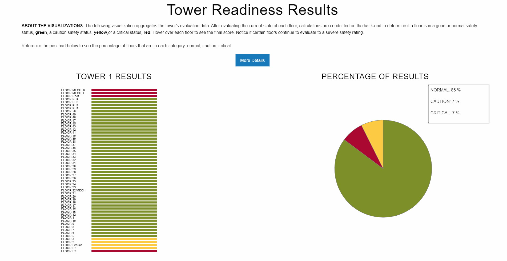
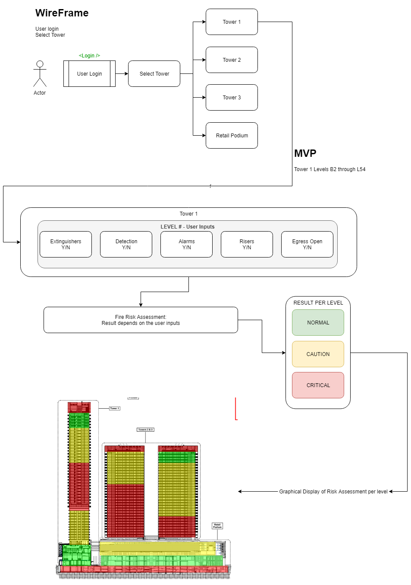
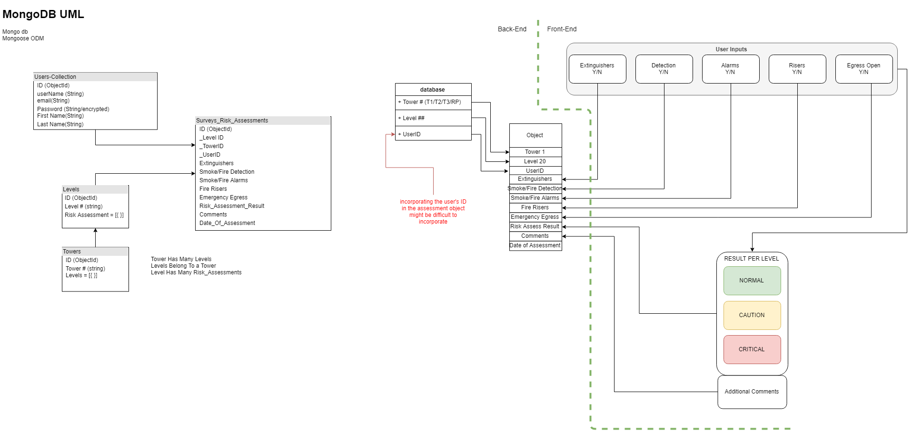

# Construction Fire Prevention Control
MVP Phase 01 deployed application [LINK](https://sleepy-eyrie-44318.herokuapp.com/)

Demo Profile
    
    Username: testProfile
    Password: Testing!1

## Problem:
Proactive Fire Prevent &amp; Control tool to help teams accurately assess fire related risks during the life cycle of a project. 

## Idea: 
Create catalogue/data set of various risks associated with all activities (high and low risk); construction schedule that will be a baseline to feed into a digital application. This will be part of an AI/ML pursuit in that the data will feed into a selected app and which will create a smart dashboard and provide insights to the project teams. 

The idea is to shift the field focus from reactionary measures to more preventative controsl. This concept makes our project teams smarter, more efficient and more proactive on identifying risks throughout the duration and flags potential blind spots. 

## Outline/Phase 1:
Proposal  - mobile application to help field team accurately assess fire related risks during the lifestyle of a project, during the finishes phase of construction and prior to commissioning. Application to utilize MVC architecture and store data for future analysis of data trends
* User-friendly data entry/output
* Visual output to be displayed on site screens and emailed to project team
* Origination of trend tracking fire related incidents w/ effectiveness of controls. 

### About the Application

The Lendlease Construction Fire: Prevent Control is a **MERN** application utilizing **MVC** architecture. It is a mobile responsive application w/ user authentication that is maintained acrross the application using JWT. The application utilizes a series of switches to document onsite field conditions to determine fire risk assessment. MVP test build for Oceanwide Plaza Project Tower 1.

### How it Works:
1. Log into the application.
2. Select Tower to review.
3. Walk the level to observe the current field conditions as the relate to the presence of fire extinguishers, smoke/fire alarms, smoke/fire detetion, fire risers & a clear path of egress.
4. Tag the item on the level you are on and click submit
5. The app will determine the current fire risk condition for that level.
6. You can see the overall condition of the tower per floor by going to the current fire risk assessment tab. Visualization of the current status of the entire tower is used using [D3.js](https://d3js.org/), 

### Fire Risk Condition
The fire risk condition is determined by a simple scoring system. Each of the inputs has a specific score and the sum of those scores determines the condition. The base conditions are:

    A condition is Normal/Green if the score is about 67.
    A condition is Caution/Yellow if the score is between 34 & 66.
    A condition is Critical/Red if the score is below 33.

### Current Fire Risk Assessment

 
### Project Wirerame

### Project UML

### Team:
Lendlease Client: **Chris South**, Lendlease Superintendent

Project Handler: **Omar Patel**

Project Team:
* Nancy Hinojos
* Ben Kha
* Lorraine Baynosa
* Cedric Orejola

For further information, please reach out to cedricorejola@gmail.com.
